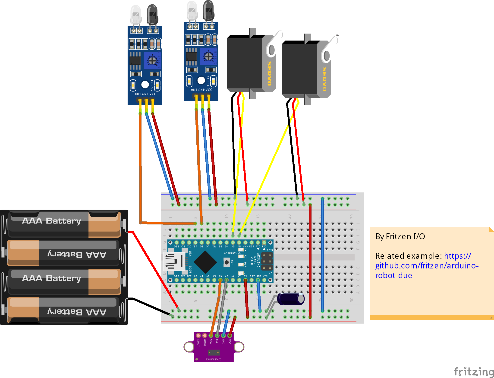
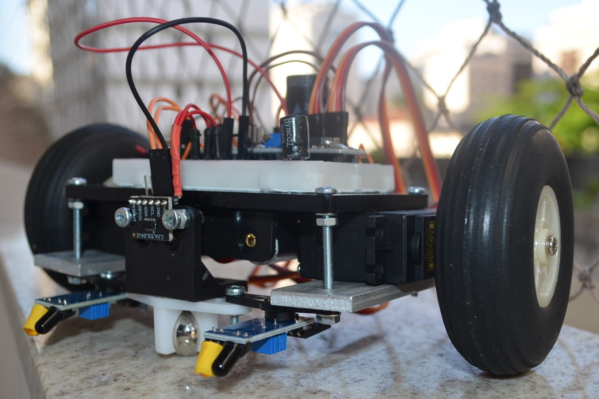

# robot-arduino-due

It`s a Line Follower Robot:

- with Laser Range VL53L0X obstacle avoid (360 turn)
- servo Mg995 Giro
- compatible With Arduino Nano

## Used libraries

Polu Laser Range VL53L0X Sensor

https://github.com/pololu/vl53l0x-arduino

## See in action on Youtube

https://www.youtube.com/watch?v=3uCTnnqyEo8

## Project Wires

## Prototype

